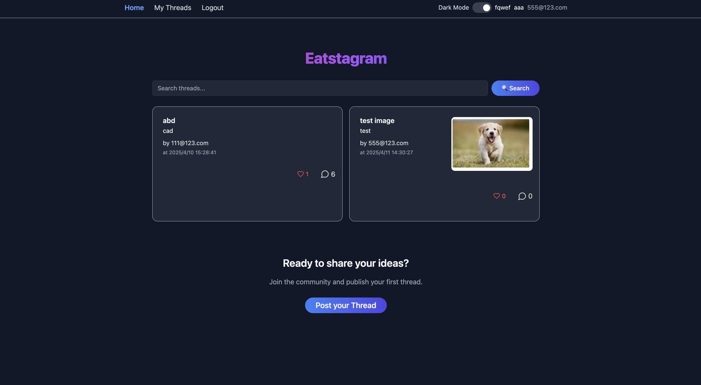
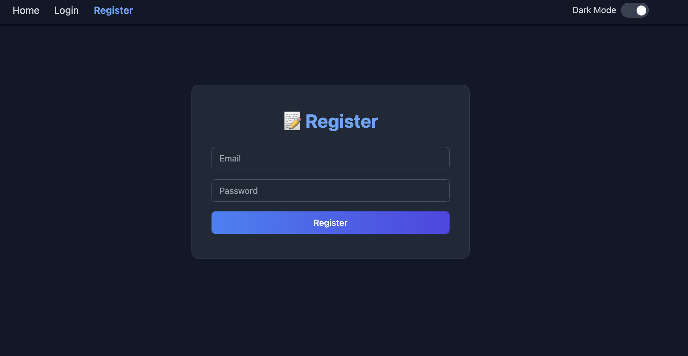
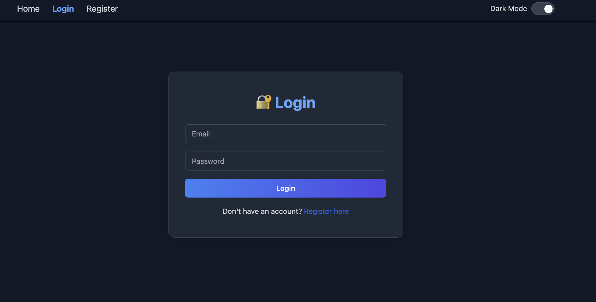
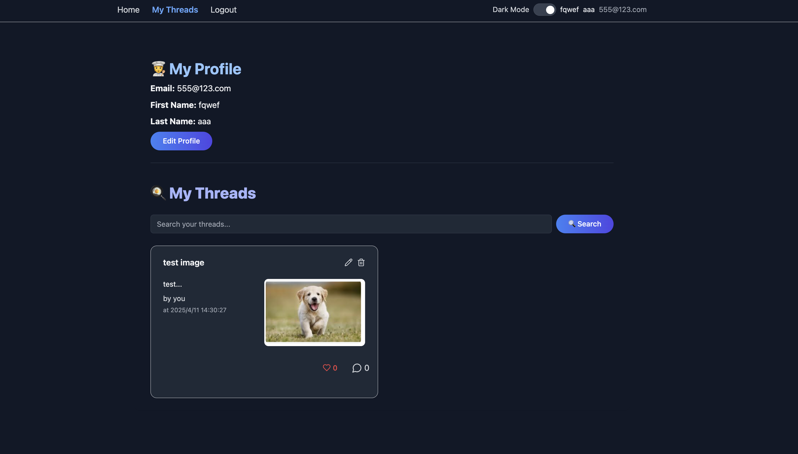
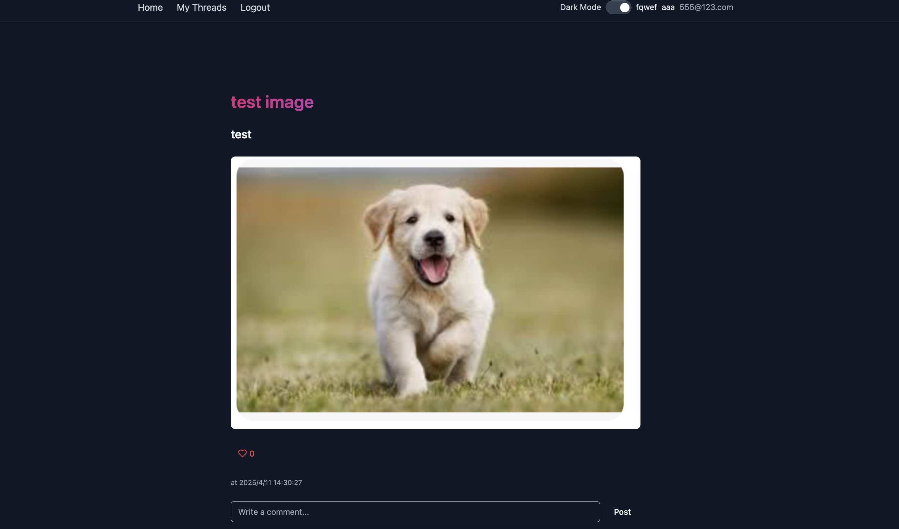

# 🥘 Eatstagram - Frontend

Eatstagram is a modern web app that allows users to create, like, and comment on posts ("threads") with a clean UI.

---

## 📋 Prerequisites

Make sure you have the following installed:

- ⚛️ **React** + **TypeScript**
- ⚡️ **Vite** – super fast dev server
- 🎨 **Tailwind CSS** – utility-first styling
- 🧩 **ShadCN UI** – beautiful, accessible UI components
- 🔗 **GraphQL** with **Apollo Client**
- 🧠 **GraphQL Code Generator** – to auto-generate TypeScript types
- 🌙 **Dark Mode** toggle with `Switch`
- 💾 **localStorage** – used for session management, likes, preferences

---

## 🔧 Setup Instructions

### 1. Clone the repository

```bash
git clone https://github.com/Quanghng/graphql-project.git
cd frontend
```

### 2. Install dependencies

```bash
npm install
```

### 3. Set up the backend

Make sure your backend (NestJS) is running at the correct URL and port (usually `http://localhost:3333`).

---

### 4. Regenerate GraphQL Types

Run this when the backend GraphQL schema changes:

```bash
npm run generate
```

It will regenerate `gql/generated.ts`.

---

### 5. Start the development server

```bash
npm run dev
```

The app will be available at `http://localhost:5174`.

---

## ✨ Features

- ✅ User login & registration with JWT
- ✅ Post threads with title, content, and image
- ✅ Filter & search threads
- ✅ Profile display (first name, last name, email)
- ✅ View all threads or user’s own threads
- ✅ Edit & delete threads
- ✅ Like system 
- ✅ Comment on threads with timestamps
- ✅ Dark mode toggle

---

## 🔐 Session Management

Session and user data are stored in `localStorage`:

```ts
localStorage.setItem("accessToken", accessToken);
localStorage.setItem("refreshToken", refreshToken);
localStorage.setItem("userId", user.id.toString());
localStorage.setItem("firstName", user.firstName || "");
localStorage.setItem("lastName", user.lastName || "");
localStorage.setItem("email", user.email);
```

---

## 🖼️ Screenshots

### Homepage



### 📝 Register



### 🔐 Login



### 🍳 My Threads



### 🧑‍💻 Thread Details


